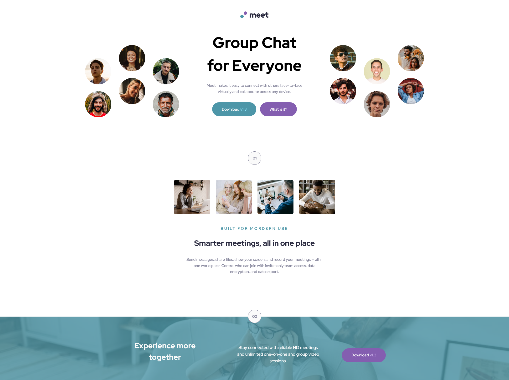
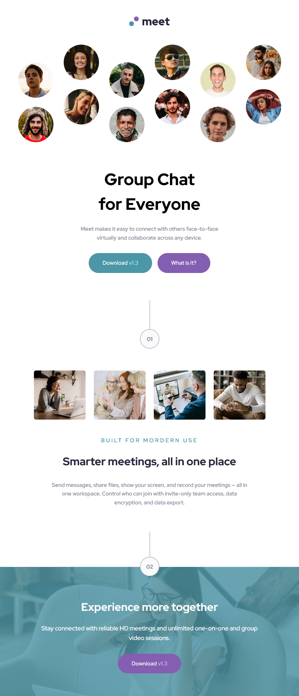

# Frontend Mentor - Meet landing page solution

This is a solution to the [Meet landing page challenge on Frontend Mentor](https://www.frontendmentor.io/challenges/meet-landing-page-rbTDS6OUR). Frontend Mentor challenges help you improve your coding skills by building realistic projects.

## Table of contents

- [Overview](#overview)
  - [Screenshot](#screenshot)
  - [Links](#links)
  - [Built with](#built-with)
  - [Author](#author)

### Screenshot

### Links

- Solution URL: [https://github.com/MitaliShah/meet-landing-page](https://github.com/MitaliShah/meet-landing-page)
- Live Site URL: [https://mitalishah.github.io/meet-landing-page/](https://mitalishah.github.io/meet-landing-page/)

### Built with

- Semantic HTML5 markup
- Flexbox
- Mobile-first workflow

## Author

- Frontend Mentor - [@MitaliShah](https://www.frontendmentor.io/profile/MitaliShah)
